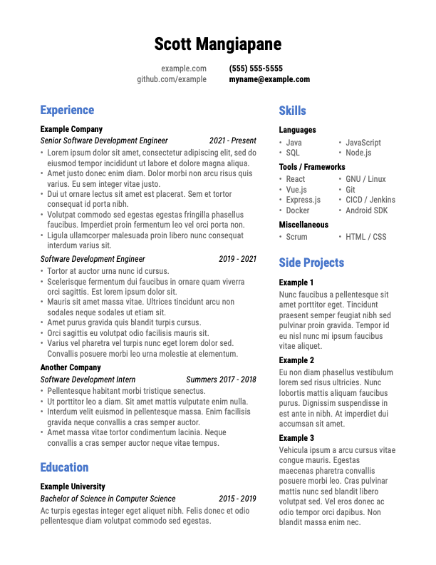

## Resume Template

This is the template I made for my own resume. Feel free to modify it for your own use.
## Set Up (MacOS)

1. Install BasicTeX.
2. Install the necessary dependencies:
    ```
    sudo tlmgr install enumitem
    sudo tlmgr install fontaxes
    sudo tlmgr install latexmk
    sudo tlmgr install paracol
    sudo tlmgr install roboto
    ```
3. Build the LaTeX project. I prefer using Visual Studio Code with the [LaTeX Workshop](https://marketplace.visualstudio.com/items?itemName=James-Yu.latex-workshop) extension, but a Makefile is included if you prefer the command line.

## Screenshot


